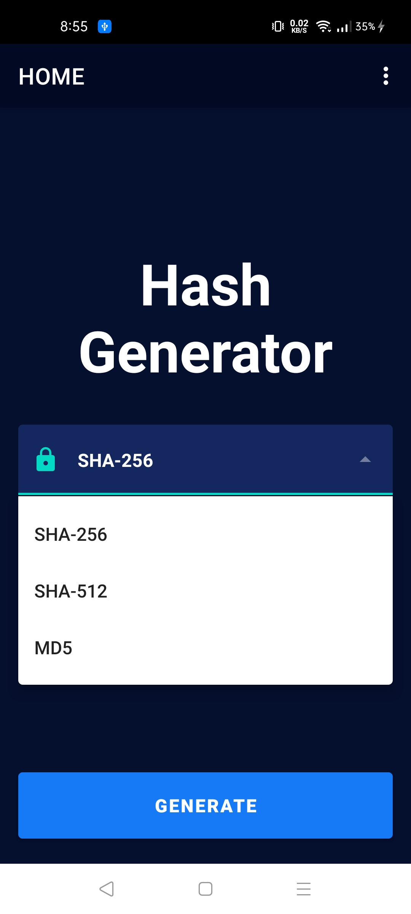

# DESCRIPTION

App Name - **HASH GENERATOR**

Language Used - **KOTLIN**

This is an application which takes input from user and produces corresponding Hash output using various hashing algorithms.

Algorithms supported -
1. SHA-256
2. SHA-512
5. MD5

# HASHING

Hashing algorithms are functions that generate a fixed-length result (the hash, or hash value) from a given input. The hash value is a summary of the original data.
For instance, think of a paper document that you keep crumpling to a point where you aren’t even able to read its content anymore. It’s almost (in theory) impossible to restore the original input without knowing what the starting data was.

# COMPONENTS

1. Navigation Components
2. Animations
3. ViewModels
4. Kotlin Coroutines

# SCREENSHOTS

# DEPENDENCIES

1. [ViewModel](https://developer.android.com/jetpack/androidx/releases/lifecycle)

2. [Navigation Component](https://developer.android.com/jetpack/androidx/releases/navigation)
